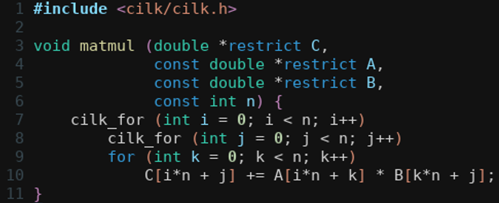
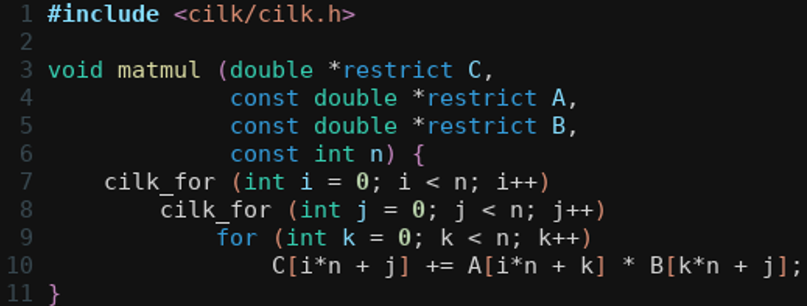
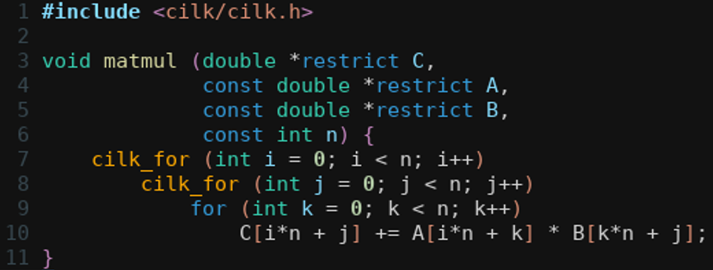
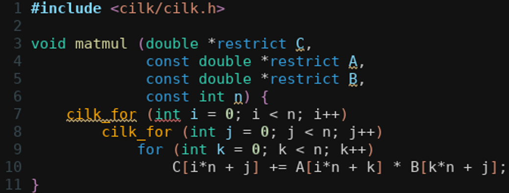

# cilk-mode

Emacs minor mode for Cilk source code editing.


## Features

By default, all of the features below are added to `cilk-mode-hook`;
activating `cilk-mode` in a buffer with major mode derived from `c-mode` or
`c++-mode` will enable all features.

To prevent a feature with corresponding function `cilk-mode-<feature>` from
being toggled automatically in `cilk-mode`, set the variable
`cilk-mode-enable-<feature>` to `nil` *before* loading the `cilk-mode.el`
package.

### Correct indentation with Cilk keywords in CC Mode 

Toggled with the function `cilk-mode-cc-keywords`.

|  |  |
|:------------------------------------------------------------------:|:-----------------------------------------------------------------:|
| in `c-mode`, before `cilk-mode-cc-keywords`                        | after `cilk-mode-cc-keywords`                                     |

### Custom font-lock face for Cilk keyword highlighting

Toggled with the function `cilk-mode-font-lock`.  Cilk keywords are fontified
with the `cilk-mode-parallel-keyword` face.  By default, the latter is the
same as `font-lock-keyword-face` but can be customized without affecting the
"regular" C/C++ keywords.

|  |  |
|:-----------------------------------------------------------------:|:----------------------------------------------------------------:|
| before `cilk-mode-font-lock`                                      | after `cilk-mode-font-lock`                                      |

### Flycheck syntax checking with OpenCilk

Toggled with the function `cilk-mode-flycheck-opencilk`.  The path to the
[OpenCilk](https://opencilk.org) compiler can be set via
`cilk-mode-flycheck-opencilk-executable`.  This feature requires the
`flycheck` package and works with the `flycheck-mode` minor mode.

|  |  |
|:-----------------------------------------------------------------:|:----------------------------------------------------------------:|
| before `cilk-mode-flycheck-opencilk`                                     | after `cilk-mode-flycheck-opencilk`                              |


## Installation

### Manual

Add the following to your `.emacs` file:

``` emacs-lisp
(add-to-list 'load-path "/path/to/cilk-mode-parent-dir")
(require 'cilk-mode)
```

### MELPA

Users of GNU Emacs (version 24.0 or greater) can install `cilk-mode` via
[MELPA](https://melpa.org/#/getting-started).  To use the MELPA repository,
make sure you have the following in your `.emacs` file:

``` emacs-lisp
(require 'package)
(add-to-list 'package-archives '("melpa" . "https://melpa.org/packages/") t)
(package-initialize)
```

Then, run `M-x package-list-packages` to find and install `cilk-mode`.

### Doom Emacs

In `.doom.d/packages.el`:

``` emacs-lisp
(package! cilk-mode
  :recipe (:host github :repo "ailiop/cilk-mode"))
```


## Configuration

### GNU Emacs

In your `.emacs` file:

``` emacs-lisp
;; customize automatically-enabled hooks in cilk-mode
;; (must be done before loading the package)
(setq cilk-mode-enable-flycheck-opencilk nil)

;; load package
(add-to-list 'load-path "/path/to/cilk-mode-parent-dir") ; if necessary
(require 'cilk-mode)

;; automatically enable cilk-mode within c-mode and c++-mode
(dolist (h '('c-mode-hook 'c++-mode-hook))
  (add-hook h #'cilk-mode))
  
;; customize Cilk keyword face
(set-face-attribute 'cilk-mode-parallel-keyword nil
                    :foreground "#FDA900") ; mustard color
                                                
;; customize path to the OpenCilk compiler (for use with flycheck)
(setq cilk-mode-opencilk-executable "/opt/opencilk/bin/clang")
```

### Doom Emacs

In `.doom.d/config.el`:

``` emacs-lisp
(use-package! cilk-mode
  :command cilk-mode
  :init
  (setq cilk-mode-enable-flycheck-opencilk nil)
  :config
  (set-face-attribute 'cilk-mode-parallel-keyword nil
                      :foreground "#FDA900") ; mustard color
  (setq cilk-mode-opencilk-executable "/opt/opencilk/bin/clang"))

(add-hook! (c-mode c++-mode) #'cilk-mode)
```
